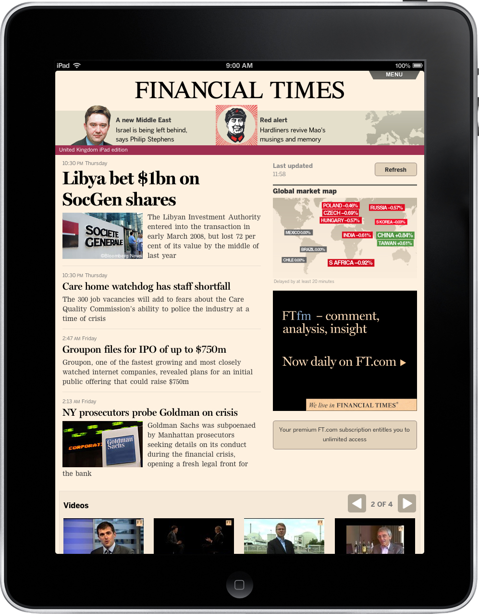
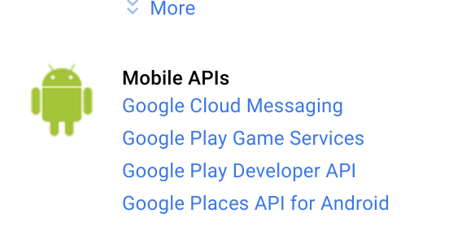
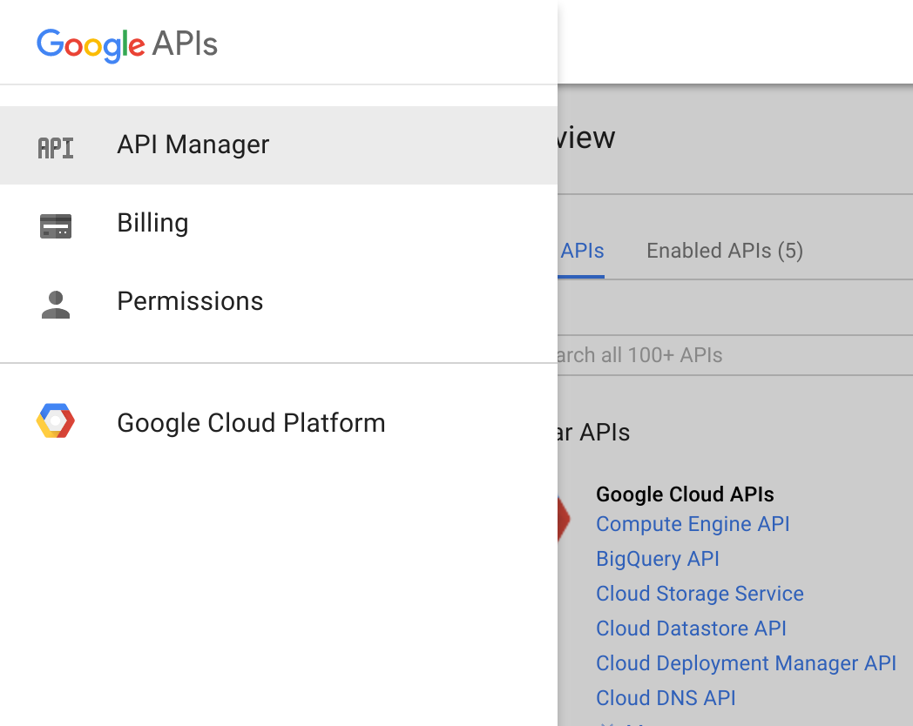
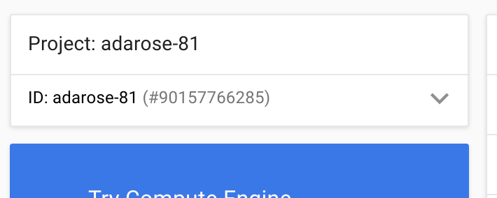
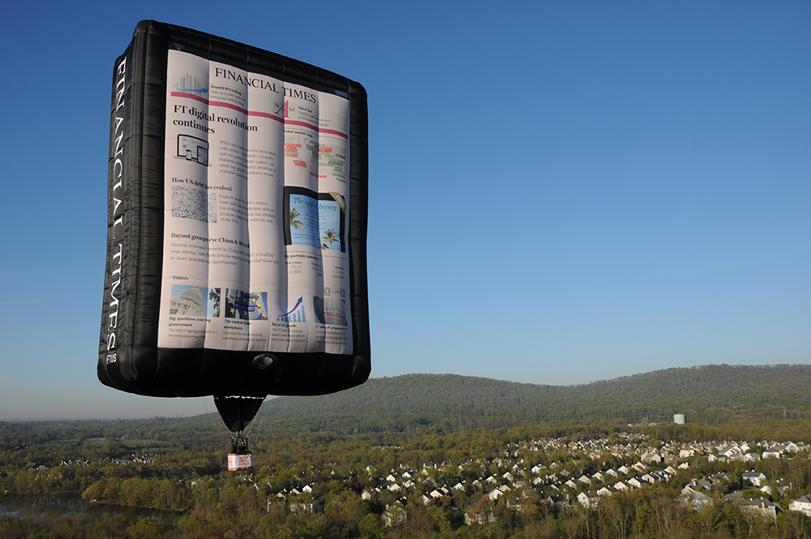

# Life of a Push Notification

[Convert to Slide Deck](#aslides)

Talk plan for SDC
Length 15-15mins, with demo.
# Plan

## Introduction

I'm Ada Edwards from the Financial Times, I'm here to talk about Progressive Web Apps.

I'd like to ask some questions before I start.

* Who here is a primarily a native app developer?
  * Who here is a native app developer who primarily uses web tech in a wrapper like Cordova?
* Who here is primarily a Web Developer?
  * Who here has built a progressive Web App before?

<blockquote class="dark" id="splash-slide" style="background-image: url('images/bird1.jpg');">
<h1>Progressive Web Apps</h1>
<div class="labs-logo"></div>
<h3>Life of a push notification</h3>
<h2>Ada Rose Edwards - Financial Times</h2>
</blockquote>

## Push Notifications

Progressive Web Apps are not new. The Financial Times chose to use a Web App for digital content delivery on mobile devices since 2012.
Moving to a Web App enabled the same app to ship across platforms using a single distribution channel.
It also allowed us to bypass app stores.
That said it did come with its' own difficulties:
We had to use the infamous appcache to enable offline support.
Difficulties arose when different platforms supported different API features. These differences need a polyfill or the feature should be avoided entirely.
Since that time features have gained support across platforms and new technologies which are useful for Web Apps such as service workers have emerged.

>

## What is a progressive web app?

* A progressive web app is a type of website which exhibits certain *app-like* properties.

(Mind map slide)

* **✈** - **Offline first** - The app must be capable of starting offline and still display useful information. With no No ‘browser-like’ elements or page loading behaviour
* **<span class="home-screen-icon">🐵</span>** - **An icon on the homescreen** - some browsers will prompt for this if it fulfills certain conditions others will not.
* **📱💻** - **Responsive** - Perfectly filling the screen, These sites are primarily aimed at mobile and tablets so will need to respond to the plethera of screen sizes. They should also just work as desktop websites too.
* **http://** - **On the open web** - Not locked in to any browser or app store.
* **👉** - **Touch capable** - An interface designed for touch with Gesture interaction
* **🔔** - **Push Notifications** - Not applicable for everyone but is very app-like

http://labs.ft.com/2012/06/what-exactly-is-an-app/

* Were going to explore creating push notifications.

>

## Prerequisits for a push notification

* Specifically we are looking at producing a web app for the Chromium 44 based Samsung browser.

<blockquote class="dark" id="splash-slide" style="background-image: url('images/nest.jpg');">
<h1>Prerequisits for a push notification</h1>
</blockquote>

Were going to begin with a Web App manifest. The top part is standard.

It defines the name on the home screen how the app should orientate itself and whether to hide the browser chrome,
i.e. whether it looks like a native app, rather than a web page when launched from the home screen.

It defines an icon, and the URL the app should use to start, in this case I add a ?standalone suffix for detecting installs with Analytics.

But the last three properties are Chrome specific, the one pertinent to us is `gcm_sender_id` without this the app won't even try prompting for push notifications.

The GCM in gcm_sender_id stands for Google Cloud Messaging and this is where we go next to get our ID

> manifest.json:
>
> ```json
{
  "name": "81 Emoji",
  "icons": [
    {
      "src": "launcher-icon-4x.png",
      "sizes": "192x192",
      "type": "image/png",
      "density": 4.0
    }
  ],
  "start_url": "/?standalone",
  "display": "standalone",
>  "orientation": "portrait",
>
>  "gcm_sender_id": "90157766285",
  "background_color": "lavenderblush",
  "theme_color": "lavenderblush"
}
> ```

* Google Cloud Messaging handles the push notifications. Which requires a google developer account.
* Use this website to set up a project and get an API key for `Google Cloud Messaging`

> # https://console.developers.google.com
> 

Finding your ID is difficult, it takes me a while to find and I've done it few times before so this is where you find it:

Insert your project ID minus the hash as your `gcm_sender_id`

> #Finding your Id
> 
> 


## Thanks

Thank you for listening I hope you have a successful app

> 
